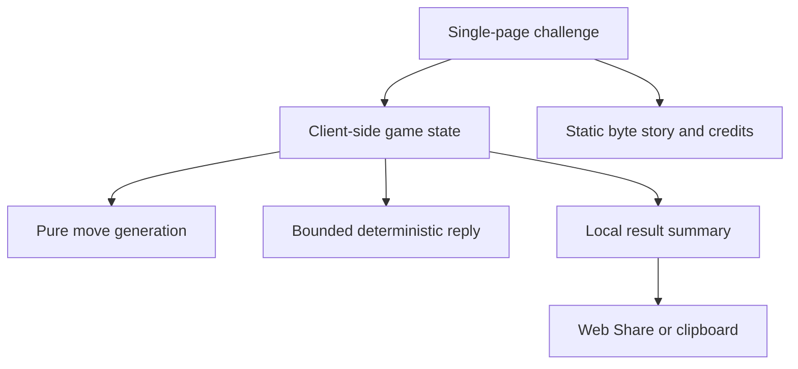

# AttoChess 278 Challenge

## Goal Capsule

- **Objective:** Turn AttoChess into a polished, viral-ready single-page web experience that lets anyone understand and play with the idea of a playable chess program in 278 bytes.
- **Authority:** The upstream `AttoChess.asm`, `README.md`, and `LICENSE` define the technical story, limitations, lineage, and attribution requirements.
- **Execution profile:** Static, client-only Vinext/React app in `web/`, published through Sites with no accounts, database, external API, scheduled job, moderation surface, application operations, or content cadence.
- **Stop conditions:** The experience must not claim that the web wrapper is 278 bytes, imply full chess-rule support, or omit Nicholas Tanner and Dmitry Shechtman attribution.
- **Tail ownership:** LFG owns implementation, review, browser verification, Git delivery, and Sites publication.

---

## Product Contract

### Summary

The site is a one-screen interactive artifact called “The 278-Byte Chess Challenge.” Its opening hook makes the size legible, offers a playful mini-board challenge inspired by AttoChess, and turns the visitor’s result into shareable copy. The supporting story reveals how the original DOS program fits board rendering, input, and four-ply search into 278 bytes.

### Problem Frame

AttoChess is technically remarkable but currently asks visitors to understand assembly, DOS tooling, and byte-golf history before the achievement feels tangible. A viral wrapper should make the central fact instantly comprehensible, reward interaction within seconds, and provide a natural reason to share without creating a service that requires maintenance.

### Actors

- A1. Curious visitor arriving from a shared link.
- A2. Chess or programming enthusiast who wants the technical explanation and source.
- A3. Mobile visitor who expects touch-first interaction and a fast, self-contained experience.

### Requirements

**Hook and comprehension**

- R1. The first viewport must use the precise hook “A playable chess program in just 278 bytes,” immediately qualify that the byte count belongs to the original DOS program, and visually compare 278 bytes with familiar digital objects.
- R2. The page must distinguish the authentic 278-byte DOS program from the larger web presentation.
- R3. The experience must explain the original program’s meaningful limitations: no castling, en passant, promotion, or full checkmate adjudication.

**Interactive challenge**

- R4. Visitors must be able to play a short, deterministic chess-flavored challenge against a client-side opponent with mouse, touch, and keyboard support.
- R5. The board must show legal destinations, reject invalid interaction, provide clear turn/status feedback, and allow an instant reset.
- R6. The interaction must remain responsive on ordinary mobile devices and cap search work so the main thread cannot lock up.
- R7. The challenge may adapt AttoChess’s compact board, vector, evaluation, and fixed-depth search ideas, but must describe itself as inspired by or adapted from AttoChess rather than literally 278 bytes.

**Viral loop**

- R8. Completing or ending a run must produce compact result copy with a challenge-specific hook and the deployed URL.
- R9. The share action must use the Web Share API when available, fall back to clipboard, and provide an explicit success/failure state.
- R10. The result presentation must invite replay without requiring identity, global scores, analytics, or a backend.
- R10a. Viral readiness must be verifiable through at least three result-copy variants under 180 characters, a prominent replay CTA, correct social-preview metadata, and a recipient-facing challenge hook; actual viral reach is not claimed without measurement.

**Story and provenance**

- R11. The page must include the record lineage, the five core size-saving ideas, the precise ruleset caveat, links to AttoChess and LeanChess, and both required copyright notices.
- R12. The app must ship a copy of the upstream MIT license or an equivalent third-party notice containing the required notices.
- R13. Site metadata and social preview must use the final product name, hook, palette, and visual motif.

**Quality**

- R14. The app must be responsive from narrow mobile through desktop, respect reduced motion, support visible focus, and use semantic accessible controls.
- R15. The entire product must build and run without hosted state, secrets, paid services, cron, or runtime calls to third-party APIs.

### Challenge Rules

- The board begins from the standard 8x8 starting position. The visitor is White and moves first.
- Supported movement is ordinary king, queen, rook, bishop, knight, and pawn movement plus captures. Castling, en passant, and promotion are unsupported. King capture ends the run; check and checkmate are not separately adjudicated, matching the original program’s intentionally reduced rule surface.
- The wrapper validates every visitor move and exposes only legal destinations under this reduced ruleset.
- A run lasts at most eight White moves. It ends immediately if either king is captured, if the side to move has no generated move, or when White’s eighth move and Black’s reply complete.
- The opponent chooses deterministically using a two-ply material search with stable source-square/destination-square tie-breaking. Search is capped at 20,000 evaluated leaf positions per reply; if the cap is reached, the best move found so far is used.
- The score is `100 + captured material - lost material + 5 × completed White moves`, using pawn 1, knight/bishop 3, rook 5, queen 9. Capturing the Black king is “You beat 278 bytes”; losing the White king is “278 bytes beat you”; otherwise the result is “You survived N moves.”
- “End & share” creates the current result at any time after the first completed player move. “Reset” discards the run without producing a result.
- Concrete fixtures: `e2e4` is accepted from the initial position; `e2e5` is rejected without changing state; repeating the same legal move history always yields the same opponent replies and result.

### Key Flows

- F1. **Understand the hook:** Visitor lands, sees the 278-byte claim, scans the size comparison, and starts the challenge.
- F2. **Play:** Visitor selects a piece, sees legal moves, makes a move, receives the deterministic reply, and continues until the short run concludes or they reset.
- F3. **Share:** Visitor ends a run, receives a playful result, invokes native share or clipboard fallback, and gets confirmation.
- F4. **Go deeper:** Visitor expands or scrolls into the byte-saving story, limitations, lineage, and source links.

### Acceptance Examples

- AE1. Given a 390px-wide touch viewport, when the visitor opens the page, then the full hook and a usable board entry point are visible without horizontal scrolling.
- AE2. Given a selected piece, when the visitor navigates with keyboard or taps a legal destination, then the move is applied, the opponent replies, and status text updates.
- AE3. Given an illegal target, when the visitor activates it, then the board state does not change and the visitor receives clear feedback.
- AE4. Given Web Share support, when a run result is shared, then the native share sheet receives result copy and the current URL; without support, the same copy is placed on the clipboard.
- AE5. Given reduced-motion preference, when the page loads and moves occur, then nonessential animation is suppressed.
- AE6. Given a production build with network access disabled after load, when the visitor plays and shares to clipboard, then the experience remains functional.
- AE7. Given a native share rejection with `AbortError`, when the visitor dismisses the share sheet, then the UI treats it as cancellation rather than failure and does not overwrite the clipboard.

### Scope Boundaries

- No user accounts, persistent global leaderboard, multiplayer, comments, moderation, analytics dependency, CMS, or scheduled daily content.
- No DOS emulator or multi-megabyte runtime; the repository previously removed a js-dos surface, and the product should preserve the contrast between a tiny original and a lightweight wrapper.
- No promise of standards-complete chess or strong engine play.
- LocalStorage may preserve only device-local preferences or a best personal result.
- “No ongoing maintenance” means no application operations or content cadence. Hosting-platform lifecycle, browser evolution, external-link availability, and optional dependency/security upgrades remain outside the guarantee.

---

## Planning Contract

### Key Technical Decisions

- KTD1. Use the generated Sites Vinext/React application in `web/` and preserve its Cloudflare Worker-compatible deployment output and `.openai/hosting.json`, while removing unused auth, database, and preview scaffold so the application exposes no stateful backend surface.
- KTD2. Implement the challenge as pure client-side TypeScript with a compact immutable position model, bounded deterministic reply selection, and no runtime network calls.
- KTD3. Use CSS and text glyphs for the visual system so the core experience has no fragile asset or CDN dependency; use a single generated raster image only for the social preview if it passes text inspection.
- KTD4. Treat the challenge as an approachable AttoChess-inspired mini-game, with legal-move guardrails and an intentionally short result loop, rather than claiming a byte-identical browser port.
- KTD5. Keep the interaction and story on one route so shared links always land directly on the hook and the Sites deployment remains operationally inert.

### Assumptions

- A polished single-page challenge with a strong result/share moment is more likely to spread than a literal DOS emulator.
- The fixed initial position and deterministic replies are sufficient for the first release; replay value comes from improving the personal result and sharing it.
- GitHub source links and static attribution are durable enough to be the only external references.

### Architecture

---

## Implementation Units

### U1. Challenge engine and testable game contract

- **Goal:** Create a deterministic, bounded client-side mini-engine with legal interaction and a short-run scoring/result contract.
- **Files:** `web/lib/chess.ts`, `web/tests/chess.test.mjs`, `web/package.json`, `web/package-lock.json`
- **Patterns:** Pure functions for position creation, move generation, move application, opponent reply, terminal detection, and result formatting.
- **Covers:** R4-R7, R10, R15; F2; AE2-AE3, AE6.
- **Test scenarios:** the exact Challenge Rules contract; initial `e2e4` acceptance and `e2e5` rejection; captures; pawn direction; king capture; deterministic reply fixtures; 20,000-leaf cap; eight-turn ending; early End & share; reset without result; stable score and result formatting.

### U2. Interactive board and viral result loop

- **Goal:** Replace the starter with the complete responsive challenge UI, including keyboard/touch board controls, status, reset, result, and resilient sharing.
- **Files:** `web/app/page.tsx`, `web/app/globals.css`, `web/app/_sites-preview/`
- **Patterns:** Client component state around pure engine functions; semantic buttons; one roving-tabindex grid where arrow keys move focus, Enter/Space select or move, Escape clears selection, an `aria-live` region announces state, and focus returns to the moved square after replies/reset; Web Share with clipboard fallback.
- **Covers:** R1-R10, R14-R15; F1-F3; AE1-AE6.
- **Test scenarios:** mobile layout; selection and legal-target styling; the specified keyboard contract; invalid interaction feedback; opponent-thinking state; End & share versus Reset; native share payload; `AbortError` cancellation; clipboard success and denial; manual copy fallback when Clipboard API is unavailable; reduced motion; high-contrast focus.

### U3. Story, attribution, and metadata

- **Goal:** Ship the byte-saving story, limitations, source lineage, required license notices, product metadata, icons, and social card.
- **Files:** `web/app/page.tsx`, `web/app/layout.tsx`, `web/public/og.png`, `web/public/third-party-notices.txt`, `web/README.md`, `web/package.json`, `web/package-lock.json`
- **Patterns:** Static content from upstream `README.md` and `LICENSE`; metadata images resolved from the incoming host; share URLs use `window.location.origin + window.location.pathname` so preview and deployed hosts both work without carrying transient state; no remote fonts or image dependencies.
- **Covers:** R2-R3, R11-R15; F4; AE1, AE5-AE6.
- **Test scenarios:** metadata uses final title/description and absolute social-image URL; social image has correct text; source and lineage links are present; the complete upstream MIT permission and warranty text plus both copyrights are present; provenance states that the browser engine is an adaptation; no starter metadata remains.

Approved story content:

1. The board bytes double as their own printable frame.
2. Fast console output replaces a separate render buffer.
3. Input constants are folded into one wrapping base address.
4. The source scan frees `CX` so search depth stays live.
5. Pawn direction is folded into the color bit.

Required notices: `Copyright (c) 2026 Nicholas Tanner` and `Copyright (c) 2019 Dmitry Shechtman`, followed by the complete MIT permission and warranty clauses from `LICENSE`.

### U4. Production validation and Sites publication

- **Goal:** Prove the complete static experience and publish the exact validated source through Sites.
- **Files:** `web/tests/rendered-html.test.mjs`, `web/.openai/hosting.json`
- **Patterns:** Production build plus rendered-output assertions; Sites-managed deployment with no D1 or R2 bindings.
- **Covers:** R13-R15; AE1-AE6.
- **Test scenarios:** build succeeds; tests pass; generated output contains the product hook, game controls, credits, and metadata; deployment succeeds and opens at the returned URL.

### U5. Remove maintenance-bearing starter surfaces

- **Goal:** Remove unused database, authentication, loading-preview, and starter-only dependencies/files so the delivered app has no application-managed backend or placeholder surface.
- **Files:** `web/app/chatgpt-auth.ts`, `web/db/`, `web/drizzle.config.ts`, `web/drizzle/`, `web/app/_sites-preview/`, `web/package.json`, `web/package-lock.json`, `web/.openai/hosting.json`
- **Covers:** R15 and the operational scope boundary.
- **Test scenarios:** no D1/R2 bindings; no auth or application API route; no Drizzle or skeleton dependency; build output makes no runtime third-party request; app remains functional after initial assets load with the network disabled.

---

## Verification Contract

| Gate | Applies to | Success signal |
| --- | --- | --- |
| `npm test` from `web/` | U1-U5 | Node test runner executes `tests/chess.test.mjs` and `tests/rendered-html.test.mjs`, then the production build succeeds. |
| `npm run lint` from `web/` | U1-U3 | No actionable lint errors. |
| Browser pipeline test | U2-U5 | Primary mobile and desktop flows work, including play, End & share, reset, stubbed native-share/clipboard states, source links, and reduced-motion-safe UI. |
| Sites deployment status | U4 | Deployment reports success and the returned URL loads the published experience. |
| Post-deployment fetch | U3-U4 | Published HTML has final title/description and absolute Open Graph image URL; the image returns successfully; share copy resolves to the deployed origin. |

---

## Definition of Done

- The first viewport makes the 278-byte achievement immediately legible and invites interaction.
- A visitor can complete the deterministic mini-challenge using touch, mouse, or keyboard.
- The result can be shared natively or copied, with clear feedback and a replay path.
- The story accurately presents AttoChess’s capabilities, limitations, lineage, and license.
- The app contains no application-managed backend, account, secret, external runtime API, or maintenance-dependent content.
- Tests, production build, lint, browser pipeline, and Sites deployment all complete successfully.
